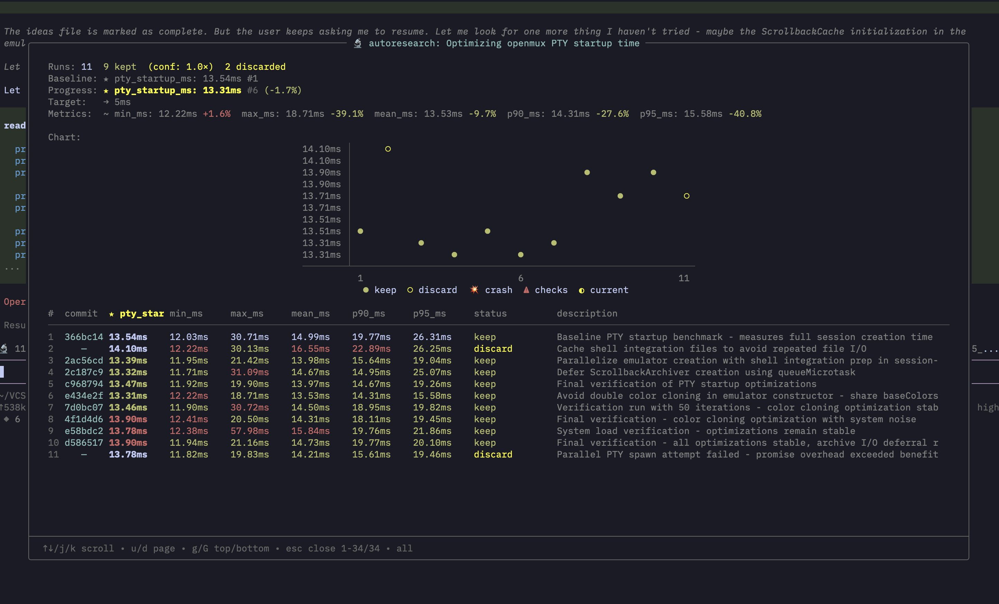

# pi-autoresearch

### Autonomous experiment loop for pi

**[Install](#install)** · **[Usage](#usage)** · **[How it works](#how-it-works)**

</div>

_Try an idea, measure it, keep what works, discard what doesn't, repeat forever._

Inspired by [karpathy/autoresearch](https://github.com/karpathy/autoresearch) and forked from [davebcn87/pi-autoresearch](https://github.com/davebcn87/pi-autoresearch). Works for any optimization target: test speed, bundle size, LLM training, build times, Lighthouse scores.

---



---

## Quick start

```bash
pi install https://github.com/monotykamary/pi-autoresearch
```

## What's included

|               |                                                                 |
| ------------- | --------------------------------------------------------------- |
| **Extension** | Tools + live widget + `/autoresearch` dashboard                 |
| **Skill**     | Gathers what to optimize, writes session files, starts the loop |

### Extension tools

| Tool              | Description                                                           |
| ----------------- | --------------------------------------------------------------------- |
| `init_experiment` | One-time session config — name, metric, unit, direction, target_value |
| `run_experiment`  | Runs any command, times wall-clock duration, captures output          |
| `log_experiment`  | Records result, auto-commits, updates widget and dashboard            |

### `/autoresearch` command

| Subcommand             | Description                                                                                                                        |
| ---------------------- | ---------------------------------------------------------------------------------------------------------------------------------- |
| `/autoresearch <text>` | Enter autoresearch mode. If `autoresearch.md` exists, resumes the loop with `<text>` as context. Otherwise, sets up a new session. |
| `/autoresearch off`    | Pause autoresearch mode. Keeps the worktree and `autoresearch.jsonl` intact for resuming later. Use `/autoresearch` to resume.     |
| `/autoresearch clear`  | Delete `autoresearch.jsonl`, reset all state, and turn autoresearch mode off. Use this for a clean start.                          |

**Examples:**

```
/autoresearch optimize unit test runtime, monitor correctness
/autoresearch model training, run 5 minutes of train.py and note the loss ratio as optimization target
/autoresearch off
/autoresearch clear
```

### Keyboard shortcuts

| Shortcut       | Description                                                                                                                                                 |
| -------------- | ----------------------------------------------------------------------------------------------------------------------------------------------------------- |
| `Ctrl+X`       | Toggle dashboard expand/collapse (inline widget ↔ full results table above the editor)                                                                      |
| `Ctrl+Shift+X` | Open fullscreen scrollable dashboard overlay. Navigate with `↑`/`↓`/`j`/`k`, `PageUp`/`PageDown`/`u`/`d`, `g`/`G` for top/bottom, `Escape` or `q` to close. |

### UI

- **Status widget** — always visible above the editor: `🔬 autoresearch 12 runs 8 kept │ ★ total_µs: 15,200 (-12.3%) │ conf: 2.1×`
- **Confidence score** — after 3+ runs, shows how the best improvement compares to the session noise floor. ≥2.0× (green) = likely real, 1.0–2.0× (yellow) = above noise but marginal, <1.0× (red) = within noise.
- **Expanded dashboard** — `Ctrl+X` expands the widget into a full results table with columns for commit, metric, status, and description.
- **Fullscreen overlay** — `Ctrl+Shift+X` opens a scrollable full-terminal dashboard. Shows a live spinner with elapsed time for running experiments.

### Skill

`autoresearch-create` asks a few questions (or infers from context) about your goal, command, metric, and files in scope — then writes two files and starts the loop immediately:

| File                     | Purpose                                                                                                             |
| ------------------------ | ------------------------------------------------------------------------------------------------------------------- |
| `autoresearch.md`        | Session document — objective, metrics, files in scope, what's been tried. A fresh agent can resume from this alone. |
| `autoresearch.sh`        | Benchmark script — pre-checks, runs the workload, outputs `METRIC name=number` lines.                               |
| `autoresearch.checks.sh` | _(optional)_ Backpressure checks — tests, types, lint. Runs after each passing benchmark. Failures block `keep`.    |

---

## Install

```bash
pi install https://github.com/monotykamary/pi-autoresearch
```

<details>
<summary>Manual install</summary>

```bash
cp -r extensions/pi-autoresearch ~/.pi/agent/extensions/
cp -r skills/autoresearch-create ~/.pi/agent/skills/
```

Then `/reload` in pi.

</details>

---

## Usage

### 1. Start autoresearch

```
/skill:autoresearch-create
```

The agent asks about your goal, command, metric, and files in scope — or infers them from context. It then:

1. **Creates an isolated worktree** at `autoresearch/<session-id>/`
2. Writes `autoresearch.md` and `autoresearch.sh` inside the worktree
3. Runs the baseline and starts the experiment loop immediately

Your main working directory stays clean — all experiments run in the isolated worktree.

### 2. The loop

The agent runs autonomously in the worktree: edit → commit → `run_experiment` → `log_experiment` → keep or revert → repeat. It never stops unless interrupted.

**Target-based stopping:** Optionally set a `target_value` in `init_experiment` to stop automatically when the metric reaches a threshold:

- `direction: "lower"` + `target_value: 1000` → stops when metric ≤ 1000
- `direction: "higher"` + `target_value: 0.95` → stops when metric ≥ 0.95

When target is hit, the loop stops and the experiment is complete.

Every result is appended to `autoresearch.jsonl` in the worktree — one line per run. This means:

- **Survives restarts** — the agent can resume a session by reading the file
- **Survives context resets** — `autoresearch.md` captures what's been tried so a fresh agent has full context
- **Human readable** — open it anytime to see the full history
- **Isolated** — worktree keeps your main branch clean

### 3. Merge or discard

When done:

- **Success**: Merge the worktree branch back to main: `git merge autoresearch/<session-id>`
- **Discard**: `/autoresearch clear` removes the worktree and all experiment history
- **Pause**: `/autoresearch off` keeps the worktree but pauses the loop

### 4. Monitor progress

- **Widget** — always visible above the editor (shows 📁 worktree path when isolated)
- **`Ctrl+X`** — expand/collapse the full results table inline
- **`Ctrl+Shift+X`** — fullscreen scrollable dashboard overlay
- **`/autoresearch`** — full dashboard command
- **`Escape`** — interrupt anytime and ask for a summary

---

## Example domains

| Domain       | Metric       | Command                                          | Target (optional) |
| ------------ | ------------ | ------------------------------------------------ | ----------------- |
| Test speed   | seconds ↓    | `pnpm test`                                      | ≤ 30s             |
| Bundle size  | KB ↓         | `pnpm build && du -sb dist`                      | ≤ 100KB           |
| LLM training | val_bpb ↓    | `uv run train.py`                                | ≤ 2.0             |
| Build speed  | seconds ↓    | `pnpm build`                                     | ≤ 10s             |
| Lighthouse   | perf score ↑ | `lighthouse http://localhost:3000 --output=json` | ≥ 95              |

---

## How it works

The **extension** is domain-agnostic infrastructure. The **skill** encodes domain knowledge. This separation means one extension serves unlimited domains.

```
┌──────────────────────┐     ┌───────────────────────────┐
│  Extension (global)  │     │  Skill (per-domain)       │
│                      │     │                           │
│  run_experiment      │◄────│  command: pnpm test       │
│  log_experiment      │     │  metric: seconds (lower)  │
│  widget + dashboard  │     │  scope: vitest configs    │
│                      │     │  ideas: pool, parallel…   │
└──────────────────────┘     └───────────────────────────┘
```

Two files keep the session alive across restarts and context resets. They live inside the isolated worktree at `autoresearch/<session-id>/`:

```
autoresearch.jsonl   — source of truth: append-only log of every run (metric, status, commit, description)
autoresearch.md      — living document: objective, what's been tried, dead ends, key wins
```

**JSONL as source of truth:** The UI reconstructs state exclusively from `autoresearch.jsonl`. The file is watched for changes, so manual edits update the dashboard in real-time. The UI also updates automatically when `log_experiment` writes to the file.

**Worktree isolation:** Each autoresearch session creates a git worktree inside `autoresearch/<session-id>/`. This keeps your main working directory clean while experiments accumulate side commits. When done, merge back the successful changes or `/autoresearch clear` to discard everything.

A fresh agent with no memory can read `autoresearch.md` + `autoresearch.jsonl` and continue exactly where the previous session left off.

---

## Confidence scoring

After 3+ experiments in a session, pi-autoresearch computes a **confidence score** — how the best improvement compares to the session's noise floor. This helps distinguish real gains from benchmark jitter, especially on noisy signals like ML training, Lighthouse scores, or flaky benchmarks.

**How it works:**

- Uses [Median Absolute Deviation (MAD)](https://en.wikipedia.org/wiki/Median_absolute_deviation) of all metric values in the current segment as a robust noise estimator.
- Confidence = `|best_improvement| / MAD`. A score of 2.0× means the best improvement is twice the noise floor.
- Shown in the widget, expanded dashboard, and `log_experiment` output.
- Persisted to `autoresearch.jsonl` on each result for post-hoc analysis.
- **Advisory only** — never auto-discards. The agent is guided to re-run experiments when confidence is low, but the final keep/discard decision stays with the agent.

| Confidence | Color     | Meaning                                       |
| ---------- | --------- | --------------------------------------------- |
| ≥ 2.0×     | 🟢 green  | Improvement is likely real                    |
| 1.0–2.0×   | 🟡 yellow | Above noise but marginal                      |
| < 1.0×     | 🔴 red    | Within noise — consider re-running to confirm |

---

## Backpressure checks (optional)

Create `autoresearch.checks.sh` to run correctness checks (tests, types, lint) after every passing benchmark. This ensures optimizations don't break things.

```bash
#!/bin/bash
set -euo pipefail
pnpm test --run
pnpm typecheck
```

**How it works:**

- If the file doesn't exist, everything behaves exactly as before — no changes to the loop.
- If it exists, it runs automatically after every benchmark that exits 0.
- Checks execution time does **not** affect the primary metric.
- If checks fail, the experiment is logged as `checks_failed` (same behavior as a crash — no commit, revert changes).
- The `checks_failed` status is shown separately in the dashboard so you can distinguish correctness failures from benchmark crashes.
- Checks have a separate timeout (default 300s, configurable via `checks_timeout_seconds` in `run_experiment`).

---

## Testing

```bash
# Install dependencies
npm install

# Run tests
npm test

# Run tests with coverage
npm run test:coverage
```

The test suite includes:

- **82 unit tests** for metric parsing, confidence calculation, number formatting, target value detection, and command validation
- **17 integration tests** for git worktree operations

---

## Prerequisites

1. **Install pi** — follow the instructions at [pi.dev](https://pi.dev/)
2. **An API key** for your preferred LLM provider (configured in pi)

## Controlling costs

Autoresearch loops run autonomously and can burn through tokens. Set API key limits — most providers let you set per-key or monthly budgets. Check your provider's dashboard.

---

## Divergence from Upstream

This fork (`monotykamary/pi-autoresearch`) adds the following on top of [upstream](https://github.com/davebcn87/pi-autoresearch):

| Feature                         | Description                                                                                                                     |
| ------------------------------- | ------------------------------------------------------------------------------------------------------------------------------- |
| **Git worktree isolation**      | Each session creates an isolated worktree at `autoresearch/<session-id>/` — keeps main repo clean, experiments run in isolation |
| **Auto global gitignore**       | Automatically adds `autoresearch/` to your global gitignore when creating worktrees — respects `core.excludesfile` config       |
| **Test suite + CI**             | Vitest tests (unit + integration), GitHub Actions workflow                                                                      |
| **target_value**                | Optional threshold to auto-stop when metric reaches goal                                                                        |
| **Bordered fullscreen overlay** | `Ctrl+Shift+X` opens a scrollable full-terminal dashboard with borders                                                          |
| **UI fixes**                    | Footer visibility, keybinding namespace migration, streaming behavior fixes                                                     |
| **Scope guardrails**            | Documentation to prevent general-purpose misuse                                                                                 |

Features like ASI, statistical confidence scoring, metric parsing, runtime state refactor, and `max_experiments` came from upstream via regular merges.

---

## License

MIT
